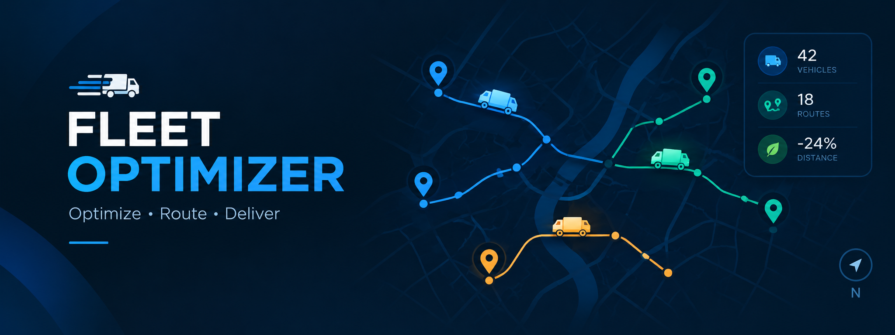

# FleetPulse

<p align="center">
  
</p>

<p align="center">
  <strong>See every vehicle clearly. Act before fuel becomes a problem.</strong><br>
  A lightweight fleet intelligence dashboard for live fuel, location, efficiency, and alert monitoring.
</p>

<p align="center">
  <a href="LICENSE"></a>
  
  
  
</p>

## The control room for a moving fleet

FleetPulse turns vehicle telemetry into a calm, usable operating picture. Monitor the latest fuel reading, position, status, efficiency, and estimated range from one responsive dashboard, then use the API to feed it real device data or local test data.

<table>
<tr>
<td width="33%"><strong>01 / Observe</strong><br>Latest vehicle telemetry, map coordinates, and fuel history in one view.</td>
<td width="33%"><strong>02 / Detect</strong><br>Low-fuel, critical-fuel, theft, and connectivity conditions surface as alerts.</td>
<td width="33%"><strong>03 / Respond</strong><br>Query history, update readings, and connect the dashboard to your workflow.</td>
</tr>
</table>

## What is inside

| Area | Capabilities |
| --- | --- |
| **Live dashboard** | Vehicle ID, fuel level, status, last update, efficiency, range, and map position |
| **Telemetry API** | Receive readings with `POST /data`; fetch the latest reading with `GET /latest` |
| **History** | Read the latest 20 fuel samples through `GET /history` for charts and analysis |
| **Fleet operations** | Vehicle, driver, trip, refuel, settings, and alert data models in the full server |
| **Frontend** | Plain HTML, CSS, and JavaScript with Leaflet map integration |
| **Storage** | Local SQLite databases for fast setup and development |

## Run it locally

### Requirements

- Python 3.8 or newer
- Flask and Flask-CORS for the API server
- A modern browser

### Start the dashboard

```bash
pip install flask flask-cors
python server.py
```

Open [http://127.0.0.1:5000](http://127.0.0.1:5000) in your browser. The server creates `fleet.db` on first run and opens the dashboard automatically when debug mode is enabled.

### Send a telemetry reading

```bash
curl -X POST http://127.0.0.1:5000/data \
  -H "Content-Type: application/json" \
  -d '{
    "vehicle_id": "TN05XY7890",
    "fuel": 72.5,
    "latitude": 13.0827,
    "longitude": 80.2707,
    "status": "normal",
    "efficiency": 12.4,
    "estimated_range": 420
  }'
```

## API at a glance

| Method | Route | Purpose |
| --- | --- | --- |
| `GET` | `/` | Serve the dashboard |
| `POST` | `/data` | Store one vehicle telemetry reading |
| `GET` | `/data` | Return the latest stored reading |
| `GET` | `/latest` | Return the latest stored reading |
| `GET` | `/history` | Return the latest 20 fuel readings |
| `GET` | `/assets/<path>` | Serve frontend assets |
| `GET` | `/views/<path>` | Serve dashboard views |

The legacy `app.py` server contains the broader FleetPulse REST model, including vehicles, alerts, trips, refuels, drivers, settings, and simulation controls.

## Repository map

```text
Fleet-Optimizer/
├── index.html          # Main fleet dashboard
├── server.py           # Flask API and static-file server
├── app.py              # Extended SQLite REST server
├── fleet.db            # Local telemetry database (generated)
├── src/
│   ├── banner.png      # README project banner
│   └── Circuit Diagram.jpeg
├── views/              # Dashboard view templates
│   ├── dashboard.html
│   ├── fleet.html
│   ├── reports.html
│   ├── alerts.html
│   └── settings.html
├── Thonny file/
│   └── vehicle.py      # Device-side vehicle prototype
├── LICENSE
└── README.md
```

## Data model

The extended server is organized around these SQLite tables:

`vehicles` | `vehicle_telemetry` | `fuel_history` | `alerts` | `trips` | `refuel_logs` | `drivers` | `settings`

Default operating thresholds are a 20% low-fuel warning, a 10% critical-fuel alert, a 5% sudden-drop threshold, and a 3-second update interval.

## Next horizon

- [ ] Authentication and role-based access
- [ ] MQTT or CoAP device ingestion
- [ ] Geofencing and maintenance alerts
- [ ] Fuel-cost recommendations and predictive analytics
- [ ] PostgreSQL support for production deployments

## License

FleetPulse is available under the [MIT License](LICENSE).

